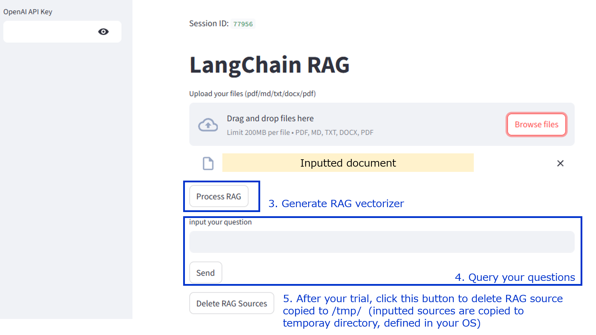

# simple-rag app

Simple-Web-App with RAG with Streamlit

## requirements

`python>3.11`

## OpenAI chatbot

`simple_rag_app/main_openai.py` supports RAG processing with OpenAI 

### startup
```
$ poetry run streamlit run simple_rag_app/main_openai.py
```

### prerequisites
if you use OpenAI chatbot, needs to publish api key at https://platform.openai.com

### how to use
1. Input your OpenAI api key in `OpenAI API key` textbox
2. Input your document. PDF/markdown/txt/docx/pptx are supported


3. After uploaded your documents to load, clickk `Process RAG`
4. Query your questions to LLM.



## local chatbot

`simple_rag_app/main_ollama.py` supports RAG processing with Ollama. 
With this scripts, you can run local LLM with RAG prompting

### startup
```
$ poetry run streamlit run simple_rag_app/main_ollama.py
```

### prerequisites
You need to install [Ollama](https://ollama.com/) before running
